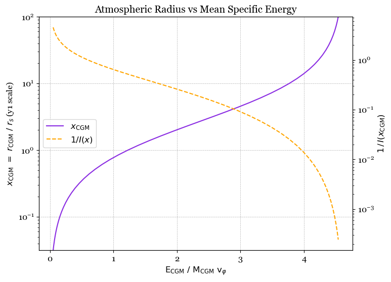
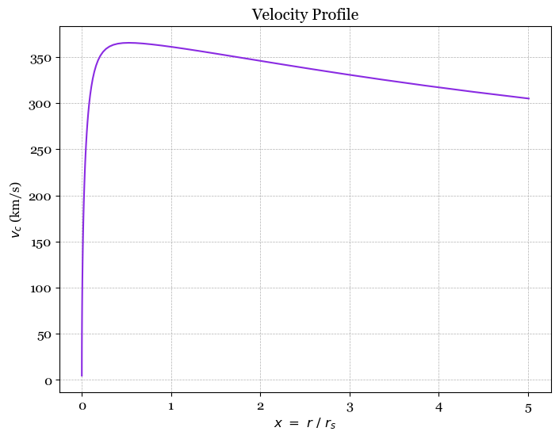

<head>
  <title>MathJax tests</title>

  <script src="https://polyfill.io/v3/polyfill.min.js?features=es6"></script>

  <script>
    MathJax = {
     tex: {
      inlineMath: [['$', '$']],
      displayMath: [ ['$$','$$'], ["\\(","\\)"] ],
      processEscapes: true
      }
     };
   </script>

   <script id="MathJax-script" async
     src="https://cdn.jsdelivr.net/npm/mathjax@3/es5/tex-chtml.js">
   </script>
</head>

# MSU Essentials Notebook

*Contributed by Doruk Yaldiz and Jazzmin Partridge, edited by Mark Voit*

These Python notebook cells present an implementation of the **ExpCGM** framework that relates a galactic atmosphere's radius to its mean specific energy, based on various assumptions about the atmosphere's pressure profile and the gravitational potential confining it. To copy and paste a cell into a notebook running locally, move your cursor to the upper left corner of the cell and click on the clipboard icon that appears.

Before executing the rest of the cells, you will want to import a few items:

```python
import numpy as np
import scipy.integrate as integrate
import matplotlib.pyplot as plt
from ipywidgets import interact, FloatSlider
```

## Power‑Law Atmosphere in an NFW Potential
As described on the [Essentials](/ExpCGM/descriptions/Essentials) page, all **ExpCGM** atmosphere models begin with a ***shape function*** that describes the shape of a galactic atmosphere's radial pressure profile:
$$
\alpha(r) = -\frac{d\ln P}{d\ln r} \; \; .
$$
We will begin with the simplest shape function: A constant value of $\alpha$ resulting in a power-law pressure profile. Farther down the page is an example in which $\alpha$ changes with radius.

This initial model also assumes an NFW gravitational potential:
$$
\varphi_{\rm NFW} (x) = A_{\rm NFW} \, v_\varphi^2 \, \left[ 1 - \frac {\ln (1+x)}{x} \right] \; \; .
$$
Here, $x = r/r_{\rm s}$ represents radius in units of the profile's scale radius $r_{\rm s}$, and $A_{\rm NFW} = 4.625$ is a normalization constant that makes the profile's maximum circular velocity (at $x = 2.163$) equal to $v_\varphi$. Note that we have chosen to put the potential's zero point at $r = 0$.

We will now set the values of some model parameters:

```python
alpha = 1.5       # constant power-law slope for pressure profile
A_NFW = 4.625     # Normalization constant for NFW potential well
eps = 10**(-4)    # Lower limit on x=r/r_s for numerical integrations
```

### Pressure Profile and Circular Velocity Profile

In general, the dimensionless pressure-profile function $f_P$ is obtained by integrating the shape function $\alpha (x)$ over $\ln x$. However, no integration is necessary for constant $\alpha$. We can simply define the pressure-profile function to be 
$$
f_P(r) = \left(\frac{r}{r_0}\right)^{-\alpha} \; \; ,
$$
where $r_0$ is the radius at which $f_P$ is normalized to unity.

The NFW potential function is given above, but we will also be using a circular velocity profile function obtained by differentating $\varphi(x)$ by $x$ and then multiplying the result by $x$:
$$
v_c^2(x) = A_{\rm NFW}\, v_\varphi^2\, \left[ \frac{\ln(1+x)}{x} - \frac{1}{1+x} \right] \; \; .
$$

This cell defines three functions determining how those profiles depend on $x = r / r_{\rm s}$:

```python
# We choose to set f_P equal to unity at r = r_s:

def f_P(x,alpha):        
    return x**(-alpha)

# We keep the NFW profile functions dimensionless and multiply them by A_NFW and v_phi^2 as needed:

def phi(x):
    return 1 - np.log(1 + x) / x 

def vc2(x):
    return np.log(1 + x) / x - 1 / (1 + x)
```

### Cumulative Mass and Energy Integrals

The [Essentials](/ExpCGM/descriptions/Essentials) page explains how **ExpCGM** determines a galactic atmosphere's total specific energy $\varepsilon_{\rm CGM} = E_{\rm CGM} / M_{\rm CGM}$ by way of several dimensionless integrals:

$$
I(x) = v_\varphi^2 \int_0^x \frac{\alpha(x)f_P(x)}{v_c^2(x)}x^2\,dx
\; \; \; \; \text{(cumulative gas mass)} 
$$
$$
J_\varphi(x) = \int_0^x \frac{\alpha(x)f_P(x)\varphi(x)}{v_c^2(x)}x^2\,dx
\; \; \; \; \text{(cumulative gravitational energy)} 
$$
$$
J_{\rm th}(x) = \frac{3}{2} \int_0^x f_P(x)\,x^2\,dx
\; \; \; \; \text{(cumulative thermal energy)} 
$$

In this example, we are modeling an atmosphere supported entirely by thermal energy $(f_{\rm th} = 1)$ and so we do not need an integral that calculates a non-thermal energy profile.

The total specific energy of this model atmosphere is
$$
\varepsilon_{\rm CGM} = \frac{E_{\rm CGM}}{M_{\rm CGM}} = v_\varphi^2\, F\left(\frac{r_{\rm CGM}}{r_0}\right)
$$
where $F(x)$ is a dimensionless profile function tracking the atmosphere's mean specific energy within $x$:
$$
F(x) = \frac{J_\varphi(x) + J_{\rm th}(x)}{I(x)}
$$

This cell defines functions that compute the necessary dimensionless mass and energy integrals:
```python
# To compute each mass and energy integral we first define a function giving the integrand, then perform the integration

def integrandI(t,alpha): 
    return f_P(t,alpha) * t**2 / vc2(t)
def I(x,alpha):        
    resultI, _ = integrate.quad(integrandI, eps, x, args=(alpha,), limit=50)
    return alpha / A_NFW * resultI

def integrandJphi(t,alpha):
    return f_P(t,alpha) * phi(t) / vc2(t) * t**2
def Jphi(x,alpha):
    resultJphi, _ = integrate.quad(integrandJphi, eps, x, args=(alpha,), limit=50)
    return alpha * resultJphi

def integrandJth(t,alpha):
    return f_P(t,alpha) * t**2
def Jth(x,alpha):
    resultJth, _ = integrate.quad(integrandJth, eps, x, args=(alpha,), limit=50)
    return 3 / 2 * resultJth

def F(x,alpha):
    return (Jphi(x,alpha) + Jth(x,alpha)) / I(x,alpha)

```

### Plotting Dependence of $r_{\rm CGM}$ on $\varepsilon_{\rm CGM}$

We now have the tools needed to reproduce the plot on the [Essentials](/ExpCGM/descriptions/Essentials) page, showing how $x_{\rm CGM} = r / r_{\rm s}$ depends on $\varepsilon_{\rm CGM}/v_\varphi^2$. First, we compute the dependence of $F(x_{\rm CGM})$ on $x_{\rm CGM}$. Then, we invert that dependence to obtain the desired plot. 

The plot also shows how the pressure-profile normalization $P_0$ at $r = r_{\rm s}$ declines as $\varepsilon_{\rm CGM}$ rises and the atmosphere expands: $P_0$ is simply proportional to $\propto 1/I(x_{\rm CGM})$.

```python
# To prepare the plot, specify a range of x and determine the range of F(x) and 1/I(x)
x_values = np.logspace(-1.5, 2, 50)
y1_values = [F(x,alpha) for x in x_values]
y2_values = [1/I(x,alpha) for x in x_values]

# Choose a font
gfont = {'fontname':'georgia'}
plt.rcParams['font.family'] = 'georgia' 
plt.rcParams['font.size'] = 12 

# Specify a figure size
fig, ax1 = plt.subplots(figsize=(8, 6))

# Plot x_CGM as a function of F(x_CGM) using a solid blue-violet line
ax1.plot(y1_values, x_values, color='blueviolet', label='$x_{\mathrm{CGM}}$')
ax1.set_xscale('linear')
ax1.set_yscale('log')
ax1.set_xlabel(r'$E_\mathrm{CGM} / M_\mathrm{CGM} v_{\varphi}^2$', fontsize=12)
ax1.set_ylabel(r'$x_\mathrm{CGM} = r_\mathrm{CGM} / r_\mathrm{s}$', fontsize=12)
ax1.set_ylim(10**-1.5, 10**2)
ax1.grid(True, linestyle='--', linewidth=0.5)

# Plot 1/I(x_CGM) as a function of F(x_CGM) using a dashed orange line
ax2 = ax1.twinx()
ax2.plot(y1_values, y2_values, color='orange', linestyle='--', label='$1/I(x)$')
ax2.set_ylabel('$1/I(x_\mathrm{CGM})$', fontsize=12)
ax2.set_yscale('log')

# Add a legend
lines_1, labels_1 = ax1.get_legend_handles_labels()
lines_2, labels_2 = ax2.get_legend_handles_labels()
ax1.legend(lines_1 + lines_2, labels_1 + labels_2, loc='center left')

# Add a title and show the plot
plt.title('Dependence of Atmospheric Radius on Mean Specific Energy', **gfont)
plt.show()

```
    

    

### Adjustable Power-Law Slope

To change the power-law slope of the pressure profile, you can change the value of $\alpha$ and execute the plotting code again, or you can use an interactive version of the plotting code with a slider that determines $\alpha$

This cell contains a function called *updatePL* that updates the plot when the slider moves:

```python
def update_alpha(alpha=1.5):
    # To prepare the plot, specify a range of x and determine the range of F(x) and 1/I(x)
    x_values = np.logspace(-1.5, 2, 50)
    y1_values = [F(x,alpha) for x in x_values]
    y2_values = [1/I(x,alpha) for x in x_values]

    # Choose a font
    gfont = {'fontname':'georgia'}
    plt.rcParams['font.family'] = 'georgia' 
    plt.rcParams['font.size'] = 12 

    # Specify a figure size
    fig, ax1 = plt.subplots(figsize=(8, 6))

    # Plot x_CGM as a function of F(x_CGM) using a solid blue-violet line
    ax1.plot(y1_values, x_values, color='blueviolet', label='$x_{\mathrm{CGM}}$')
    ax1.set_xscale('linear')
    ax1.set_yscale('log')
    ax1.set_xlabel(r'$E_\mathrm{CGM} / M_\mathrm{CGM} v_{\varphi}^2$', fontsize=12)
    ax1.set_ylabel(r'$x_\mathrm{CGM} = r_\mathrm{CGM} / r_\mathrm{s}$', fontsize=12)
    ax1.set_ylim(10**-1.5, 10**2)
    ax1.grid(True, linestyle='--', linewidth=0.5)

    # Plot 1/I(x_CGM) as a function of F(x_CGM) using a dashed orange line
    ax2 = ax1.twinx()
    ax2.plot(y1_values, y2_values, color='orange', linestyle='--', label='$1/I(x)$')
    ax2.set_ylabel('$1/I(x_\mathrm{CGM}) \propto P(r_\mathrm{s})$', fontsize=12)
    ax2.set_yscale('log')

    # Add a legend
    lines_1, labels_1 = ax1.get_legend_handles_labels()
    lines_2, labels_2 = ax2.get_legend_handles_labels()
    ax1.legend(lines_1 + lines_2, labels_1 + labels_2, loc='center left')

    # Add a title and show the plot
    plt.title('Dependence of Atmospheric Radius on Mean Specific Energy', **gfont)
    plt.show()
```

Running the next cell then makes an interactive plot with an adjustable value of $\alpha$:

```python
#   continuous_update=True allows the graph to update while slider is moved
#   continuous_update=False updates the graph after the slider stops moving

alpha_slider = FloatSlider(min=1.25, max=2.5, step=0.01, value=1.5, continuous_update=True)
interact(update_alpha, alpha=alpha_slider);
```

    

    
