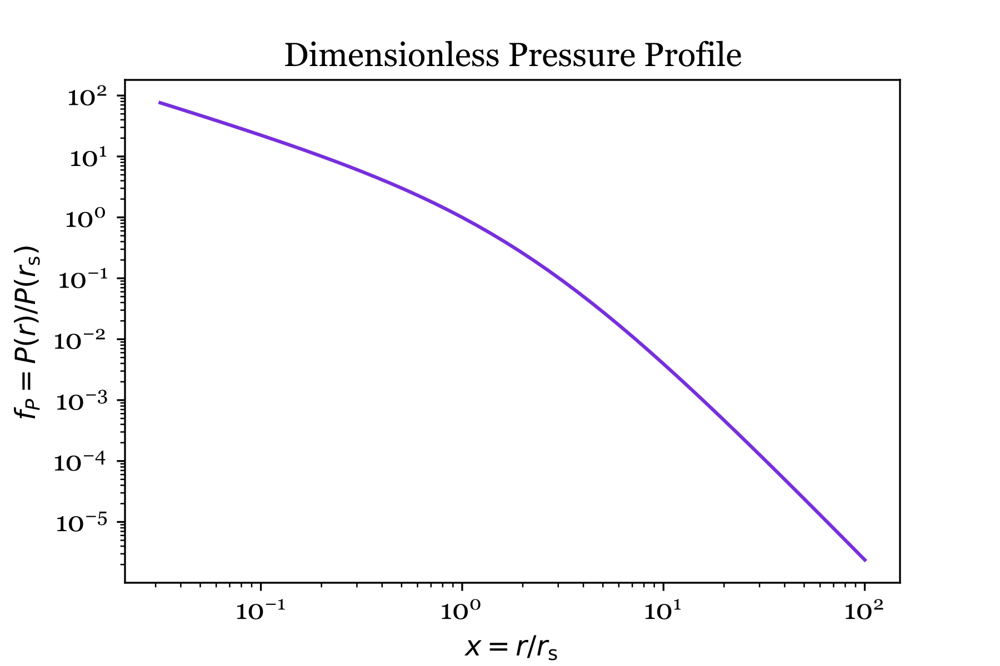

<head>
  <title>MathJax tests</title>

  <script src="https://polyfill.io/v3/polyfill.min.js?features=es6"></script>

  <script>
    MathJax = {
     tex: {
      inlineMath: [['$', '$']],
      displayMath: [ ['$$','$$'], ["\\(","\\)"] ],
      processEscapes: true
      }
     };
   </script>

   <script id="MathJax-script" async
     src="https://cdn.jsdelivr.net/npm/mathjax@3/es5/tex-chtml.js">
   </script>
</head>

# MSU Generalizable Notebook

*Contributed by Doruk Yaldiz and Jazzmin Partridge, edited by Mark Voit*

The Python notebook cells on this page demonstrate how to extend the **ExpCGM** implementation in the [MSU Essentials Notebook](/ExpCGM/notebooks/MSUEssentials) to incorporate a user-defined pressure profile shape, a user-defined gravitational potential, and non-thermal atmospheric support energy. To copy and paste a cell into a Python notebook running on your own computer, move your cursor to the upper left corner of the cell and click on the clipboard icon that appears.

Before executing the cells that follow, import these items:  

```python
import numpy as np
import scipy.integrate as integrate
import matplotlib.pyplot as plt
from ipywidgets import interact, FloatSlider
```

## User-Defined Pressure Profiles

To implement a pressure profile that is not a simple power law, an **ExpCGM** user needs to specify the pressure profile's shape by supplying a shape function $\alpha(x)$ that depends on a dimensionless radius $x$. 

We will demonstrate how to do that by implementing the generalized NFW profile discussed on the [Pressure Profiles](/ExpCGM/extensions/PressureProfiles) page. It has the shape function
$$
\alpha(r) = - \alpha_\mathrm{in} 
            - (\alpha_\mathrm{out} - \alpha_\mathrm{in} )
              \frac{(x/x_\mathrm{tr})^{\alpha_\mathrm{tr}}}
                  {1+(x/x_\mathrm{tr})^{\alpha_\mathrm{tr}}}
$$
Its power-law slope therefore approaches $\alpha_\mathrm{in}$ at small radii and steepens to $\alpha_\mathrm{out}$ at large radii. The transition in slope happens near the radius $r_\alpha$, and the $\alpha_\mathrm{tr}$ parameter governs the sharpness of the transition.

The following cell defines a generalized NFW shape function with the parameter set $\alpha_\mathrm{in} = 1.0$, $\alpha_\mathrm{out} = 3.4$, $\alpha_\mathrm{tr} = 1.0$, and  $x_\mathrm{tr} = 2.16$. Users can customize the pressure profile either by adjusting these parameters or by replacing this form of $\alpha (x)$ with a different one:

```python
def alpha(x):
    alpha_in = 1.0
    alpha_out = 3.4
    alpha_tr = 1.0
    x_tr = 2.16
    y = ( x / x_tr )**alpha_tr
    return alpha_in + (alpha_out - alpha_in) * y / ( 1 + y)
```

A numerical integration is now needed to determine the dimensionless pressure profile function because $\alpha(x)$ is not constant: 
$$
f_P(r) = \exp \left[ -\int_1^{r/r_0} \frac{\alpha(x)}{x}dx \right]
$$
Executing the next cell defines a function that integrates $\alpha (x)$ over $\ln x$ to obtain a version of $f_P(x)$ that is normalized to unity at $r = r_\mathrm{s}$:

```python
def integrandf_P(t):
    return alpha(t) / t

def f_P(x):        
    resultf_P, _ = integrate.quad(integrandf_P, 1+eps, x, limit=50)
    return np.exp(-resultf_P)

```

To check the result, this cell makes a plot showing $f_P(x)$:

```python
# Specify the domain of x and determine f_P(x)
x_values = np.logspace(-1.5, 2, 50)
y_values = [f_P(x) for x in x_values]

# Choose a font
gfont = {'fontname':'georgia'}
plt.rcParams['font.family'] = 'georgia' 
plt.rcParams['font.size'] = 12 

plt.plot(x_values, y_values, color='blueviolet')
plt.xscale('log')
plt.yscale('log')
plt.xlabel(r'$x = r / r_\mathrm{s}$', fontsize=12)
plt.ylabel(r'$f_P = P(r)/P(r_\mathrm{s})', fontsize=12)

plt.title('Dimensionless Pressure Profile', **gfont)
plt.show()
```


In the **ExpCGM** framework, a pressure profile's normalization depends on the atmosphere's mean specific energy ($\varepsilon_\mathrm{CGM}$). In this case, the normalization factor is
$$
P_0 = P(r_\mathrm{s}) = \frac {M_\mathrm{CGM} v_\varphi^2} {4 \pi r_\mathrm{s}^3} \frac {1} {I(x_\mathrm{CGM})} 
$$
The function $I(x)$ is an integral proportional to the cumulative enclosed gas-mass profile, as explained on the [Essentials](/ExpCGM/descriptions/Essentials) page, and $x_\mathrm{CGM}$ is a dimensionless radius that solves $\varepsilon_\mathrm{CGM} = v_\varphi^2  F(x_{\rm CGM})$.

## User-Defined Potential Wells

The default choice for a halo potential well in **ExpCGM** is an NFW potential well, described by the dimensionless functions defined in the following cell:

```python
A_NFW = 4.625      # Normalization constant for the NFW potential well

def vc2_NFW(x):
    return np.log(1+x) / x - 1 / (1+x)

def phi_NFW(x):
    return 1- np.log(1+x)/x
```

Later, we will multiply each of these functions by $v_\varphi^2$, the square of the halo's maximum circular velocity, to make them dimensional quantities. You may also choose to replace the NFW potential with a user-defined potential well.

To illustrate how to customize the potential well, we will extend the NFW halo model by adding a central galaxy with a maximum circular velocity $v_\mathrm{H} = f_\mathrm{H} v_\varphi$, where $f_\mathrm{H}$ is an adjustable model parameter. To represent the central galaxy, we use a Hernquist potential with a scale radius $r_\mathrm{H} = x_\mathrm{H} r_\mathrm{s}$: 
$$
\varphi_\mathrm{H} = 4 v_\mathrm{H}^2 \left( 1 + \frac {r_\mathrm{H}} {r + r_\mathrm{H}} \right)
$$

The dimensionless functions in this cell are defined so that they give the appropriate dimensional quantities when multiplied by $v_\varphi^2$ or $v_\varphi$:

```python
def phi_gal(x,x_H,f_H):
    return 4 * f_H**2 * (1 - x_H / (x + x_H) )

def vc2_gal(x,x_H,f_H):
    return 4 * f_H**2 * x_H * x / (x + x_H)**2

def phi(x,x_H,f_H):
    return phi_NFW(x) + phi_gal(x,x_H,f_H)

def vc2(x,x_H,f_H):
    return vc2_NFW(x) + vc2_gal(x,x_H,f_H)

def vc(x,x_H,f_H):
    return np.sqrt(vc2(x,x_H,f_H))
```

To check the result, this cell makes a plot showing $v_\mathrm{c}(x)/v_\varphi$ for $x_H = 0.1$ and $f_H = 1.0$:

```python
# Set the parameters of the Hernquist model 
x_H = 0.1
f_H = 1.0

# Specify the domain of x and determine v_c
x_values = np.logspace(-1.5, 2, 50)
vc_values = [vc(x,x_H,f_H) for x in x_values] 

# Choose a font
gfont = {'fontname':'georgia'}
plt.rcParams['font.family'] = 'georgia' 
plt.rcParams['font.size'] = 12 

# Make the plot
plt.plot(x_values, vc_values, color='blueviolet')
plt.xscale('log')
plt.yscale('linear')
plt.xlabel(r'$x = r / r_\mathrm{s}$', fontsize=12)
plt.ylabel(r'$v_\mathrm{c} / v_\varphi$', fontsize=12)

plt.title('Dimensionless Circular Velocity Profile', **gfont)
plt.show()
```


## Temperature Profile and Halo Mass

In the **ExpCGM** framework, the temperature profile of an atmosphere fully supported by thermal pressure depends only on $\alpha(x)$ and $v_c(x)$: 
$$ 
kT(x) = \frac { \mu m_p v_\mathrm{c}^2 (x) } { \alpha(x) }
$$
However, the normalization factor $v_\varphi$ of the circular velocity profile depends on the total mass $M_\mathrm{halo}$ within a bounding radius $r_\mathrm{halo}$.

The usual procedure for calculating the normalization factor is to define the halo's radius so that the mean matter density within $r_\mathrm{halo}$ is $\Delta_\mathrm{halo}$ times the universe's critical density at the halo's redshift $z$. Then the circular velocity at $r_\mathrm{halo}$ is 
$$
v_\mathrm{c}(r_\mathrm{halo}) 
  = \left( \frac {\Delta_\mathrm{halo}} {2} \right)^{1/6}
    \left[ G M_\mathrm{halo} H(z) \right]^{1/3}
$$
The following cell defines a function that returns $v_\mathrm{halo}$ in units of kilometers per second when given $z$, $\Delta_\mathrm{halo}$, and $M_\mathrm{halo}$ in units of solar mass:

```python
def vhalo_kms(M_halo,z,Delta):

  # Specify some constants
  G = 6.67e-8     # gravitational constant in cgs units
  H0 = 1./4.4e17  # current Hubble constant in inverse seconds
  MSun = 2.e33    # solar mass in grams
  Omat = 0.3      # cosmological matter density parameter

  # Determine H(z)
  Hz = H0 * np.sqrt( Omat * (1+z)**3 + (1 - Omat) )

  # Convert M_halo to grams
  M_halo_grams = M_halo * MSun

  # Determine v_c  at r_halo
  vc_rhalo_cgs = ( Delta / 2 )**(1/6) * ( G * Mhalo_grams * Hz )**(1/3)

  # Return vc(rhalo) in km/s
  return vc_rhalo_cgs / 1e5
  
```

To obtain the $v_\mathrm{c}$ normalization factor for an NFW halo model, the halo's the concentration factor $c_\mathrm{halo} = r_\mathrm{halo} / r_\mathrm{s}$ must be specified. The next cell defines a function that computes $v_\varphi$ when given $v_\mathrm{halo}$ and $c_\mathrm{halo}$:

```python
def v_phi_NFW(v_halo,c_halo):
  return v_halo / np.sqrt( vc2_NFW(c_halo) )
```

Once that function is defined, executing this cell makes a plot showing the normalized circular velocity profile:

```python
# Set the parameters of the NFW halo model 
M_halo = 1e12
z_halo = 0.0
c_halo = 10
Delta_halo = 200

# Determine v_phi for the NFW profile
v_phi = v_phi_NFW(vhalo_kms(M_halo,z_halo,Delta_halo),c_halo)

# Determine r_halo for the NFW model
G = 6.67e-8
cm_per_kpc = 3.08e21
g_per_MSun = 2e33
rhalo_cm = G * M_halo * g_per_MSun / (vhalo_kms(M_halo,z_halo,Delta_halo) * 1e5)**2
rhalo_kpc = rhalo_cm / cm_per_kpc

# Set the parameters of the Hernquist model 
x_H = 0.1
f_H = 1.0

# Specify the domain of x and determine r in kpc and v_c in km/s
x_values = np.logspace(-1.5, 2, 50)
r_values = [x * rhalo_kpc / c_halo for x in x_values]
vc_values = [v_phi * vc(x,x_H,f_H) for x in x_values] 

# Choose a font
gfont = {'fontname':'georgia'}
plt.rcParams['font.family'] = 'georgia' 
plt.rcParams['font.size'] = 12 

# Make the plot
plt.plot(r_values, vc_values, color='blueviolet')
plt.xscale('log')
plt.yscale('linear')
plt.xlabel(r'$r \; \; (kpc)$', fontsize=12)
plt.ylabel(r'$v_\mathrm{c} \; \;  (km/s)$', fontsize=12)

plt.title('Normalized Circular Velocity Profile', **gfont)
plt.savefig('vc_vs_r.pdf')
plt.show()
```


Multiplying $v_\mathrm{c}^2(r)$ by $\mu m_p$ and dividing by $\alpha(r)$ then gives the model's hydrostatic temperature profile:


## Cumulative Mass and Energy Integrals

We also redefine the energy integrals so they have $\alpha(x)$ inside them. We can also define the $v_c^2(x)$ and $\varphi(x)$ functions the same way again so each section of the notebook is self-contained.


```python

# Set a lower limit on x=r/r_s for numerical integrations
eps = 10**(-4)     

# Integrate to obtain cumulative mass profile
def integrandI(t):
    return alpha(t) * f_P(t) * t**2 / vc2(t)
def I(x):        
    resultI, _ = integrate.quad(integrandI, eps, x, limit=50)
    return 1 / A_NFW * resultI

# Integrate to obtain cumulative gravitational energy profile
def integrandJphi(t):
    return alpha(t) * f_P(t) * phi(t) / vc2(t) * t**2
def Jphi(x):
    resultJphi, _ = integrate.quad(integrandJphi, eps, x, limit=50)
    return resultJphi

# Integrate to obtain cumulative thermal energy profile
def integrandJth(t):
    return f_P(t) * t**2
def Jth(x):
    resultJth, _ = integrate.quad(integrandJth, eps, x, limit=50)
    return 3 / 2 * resultJth

def F(x):
    return (Jphi(x) + Jth(x)) / I(x)
```


```python
# Plotting the results

x_values = np.logspace(-1.5, 4, 50)
y_values = [F(x) for x in x_values]

gfont = {'fontname':'georgia'}
plt.rcParams['font.family'] = 'georgia' 
plt.rcParams['font.size'] = 12 
plt.figure(figsize=(8, 6))
plt.plot(y_values, x_values, color='blueviolet')
plt.xlim(0, 4.7)
plt.xscale('linear')
plt.yscale('log')
plt.title('Atmospheric Radius vs Mean Specific Energy', **gfont)
plt.xlabel(r'$\mathrm{E}_{\mathrm{CGM}} \ / \ \mathrm{M}_{\mathrm{CGM}} \ \mathrm{v}_{\varphi}$', fontsize=12)
plt.ylabel(r'$x_{\mathrm{CGM}} \ = \ r_\mathrm{CGM} \ / \ r_s$', fontsize=12)
plt.grid(True, linestyle='--', linewidth=0.5)
plt.show()
```


```python
# In this version, if we let both v_c^2 and alpha go to 0, the J_phi integral misbehaves causing double values
# One solution to this is to go back to a model with constant alpha.
# Another is to give a lower bound to alpha, taking the maximum of the two functions
# This approach works for down to alpha = ~0.7, though it gives an increasingly jagged graph

def alpha(x):
    # return 3.4 * ( x/rmax /(1+x/rmax) )   # option 1
    
    return 1.5   # option 2
    
    # alpha1 = 3.4 * ( x/rmax /(1+x/rmax) )
    # alpha2 = 0.7
    # return max(alpha1,alpha2)   # option 3

def integrandf_P(t):
    return alpha(t) / t

def f_P(x):
    resultf_P, _ = integrate.quad(integrandf_P, 1+eps, x, limit=50)
    return np.exp(-resultf_P)

def integrandphi(t):
    return vc2(t) / t

def phi(x):
    resultphi, _ = integrate.quad(integrandphi, eps, x, limit=50)
    return resultphi

def integrandI(t):
    return alpha(t) * f_P(t) * t**2 / (vc2(t))

def I(x):        
    resultI, _ = integrate.quad(integrandI, eps, x, limit=50)
    return resultI

def integrandJphi(t):
    return alpha(t) * f_P(t) * phi(t) / vc2(t) * t**2

def Jphi(x):
    resultJphi, _ = integrate.quad(integrandJphi, eps, x, limit=50)
    return resultJphi

def integrandJth(t):
    return f_P(t) * t**2

def Jth(x):
    resultJth, _ = integrate.quad(integrandJth, eps, x, limit=50)
    return 3 / 2 * resultJth

def F(x):
    return (Jth(x)+Jphi(x)) / I(x)
```
    

    

```python
# Plotting the results

x_values = np.logspace(-1.5, 2.2, 50)
y_values = [F(x) for x in x_values]

gfont = {'fontname':'georgia'}
plt.rcParams['font.family'] = 'georgia' 
plt.rcParams['font.size'] = 12 
plt.figure(figsize=(8, 6))
plt.plot(y_values, x_values, color='blueviolet')
plt.title('Atmospheric Radius vs Mean Specific Energy', **gfont)
plt.xscale('linear')
plt.yscale('log')
plt.xlabel(r'$\mathrm{E}_{\mathrm{CGM}} \ / \ \mathrm{M}_{\mathrm{CGM}} \ \mathrm{v}_{\varphi}$', fontsize=12)
plt.ylabel(r'$x_{\mathrm{CGM}} \ = \ r_\mathrm{CGM} \ / \ r_s$', fontsize=12)
plt.grid(True, linestyle='--', linewidth=0.5)
plt.show()
```

